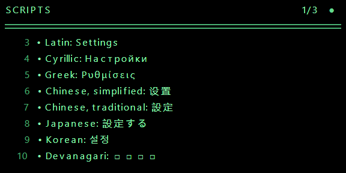
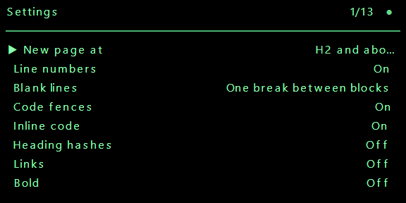

# Nib on the Even Realities G2

The plugin is the web app with one thing added: a bridge that keeps the glasses
showing whatever note is active in it, and lets the glasses say back which note
that should be. Same components, same stores, same browser storage, same sign-in,
same sync. It is served at `https://nibeditor.com/even/`, and it does nothing at
all in a browser that has no glasses behind it.

**Everything on the panel is text.** No image container is made at all: a page of
words is one call of about 83 ms where four image sends are 740, and the whole of
what a note means has to be said in one font in one size with no alignment. How
that is done is section 3, and it is the most interesting page here.


Everything below was written against **`@evenrealities/even_hub_sdk` 0.0.15**
(published 2026-09-07), **`@evenrealities/evenhub-cli` 0.1.14** and
**`@evenrealities/evenhub-simulator` 0.9.5**. Where a fact came from the SDK's
own `dist/index.d.ts` or from a published document it is stated as such; where it
is an assumption, it says so.

---

## 1. The platform

### How an app is put together

An Even Hub app is a web page. The Even Realities phone app opens it in a
WebView (Chromium on Android, WKWebView on iOS) and the page talks to the
glasses over a channel the phone owns; no code of ours runs on the glasses
themselves. There are two ways to get a page in front of a pair:

- **Development.** `evenhub qr --url <address>` prints a QR code; the phone app
  scans it and loads that address directly over the network. Hot reloading
  works. The WebView is suspended whenever the phone app goes to the background,
  which is why this mode cannot be used to satisfy a review.
- **Release.** `evenhub pack app.json <build folder>` writes an `.ehpk`, which is
  uploaded in the developer portal and installed through the phone app. Files are
  served to the WebView from the phone.

The SDK is an ordinary npm dependency, but it is only a wrapper over a bridge the
host injects. Importing it puts a singleton on `window.EvenAppBridge`, a message
handler on `window._listenEvenAppMessage`, and sends everything out through
`window.flutter_inappwebview.callHandler('evenAppMessage', …)`. Outside that
WebView every call fails, which is why `sdk.ts` checks for the host handler
before importing the SDK at all.

### `app.json`

`apps/desktop/even.app.json`. Nine keys, and the CLI's own schema accepts no
others (extra keys are dropped silently, which is worth knowing before inventing
one). There is **no icon field**: the portal takes the icon as an upload.

| Key | Rule |
| --- | --- |
| `package_id` | reverse domain, `^[a-z][a-z0-9]*(\.[a-z][a-z0-9]*)+$`. No hyphens, no underscores. |
| `edition` | exactly `"202601"` |
| `name` | at most 20 characters, and **must not contain "Even"** in any case: names that do are rejected as impersonation |
| `version` | `x.y.z`, no prefix, no pre-release |
| `min_app_version` | the phone app floor; `evenhub pack` stamps it from the SDK unless `--enforce-manual-version` |
| `min_sdk_version` | the SDK built against |
| `entrypoint` | a path inside the build folder: for us `even.html` |
| `permissions` | array of `{ name, desc }`, plus `whitelist` for `network`. **The names are a fixed list and it is published nowhere**; see below. |
| `supported_languages` | from `en de fr es it zh ja ko`. Swiss German has no code here, so it is not listed. |

**The permission names are a closed vocabulary.** The CLI takes `g2-microphone`,
`phone-microphone`, `album`, `location`, `network` and `camera`, and nothing else;
anything else fails the pack with

```
permissions.1.name: each permission must be an object with name
(g2-microphone, phone-microphone, album, location, network, camera)
```

That list is read off that error and is not published anywhere, which is how a
manifest asking for `microphone` reached the end of a release before failing. The
plugin asks for `network` and for **both** microphones, because it listens through
both; see section 5. A test in `even/manifest.test.ts` now holds the manifest to
every rule on this page, because all of them are silent until a release.

Our `network` whitelist is **one origin**, `https://nibeditor.com`: one entry per
full origin, no wildcards, no bare hostnames. The phone app blocks any request to a
host that is not on it before the request leaves the WebView, and CORS still
applies on top of that.

`https://api.openai.com` was the second entry until the key became write-only. The
plugin has no key to send now, so it makes no request to OpenAI, so the origin comes
off - and the description says what the one that is left is for: signing in, keeping
the notes in step, and asking a question. See section 5.

### The display

- **576 by 288 pixels, four bits a pixel: sixteen levels of green.** Level zero
  is a pixel that is off, which on these glasses is see-through rather than
  black. So a page is drawn as light on nothing.
- At most **four image containers and eight text or list containers**, twelve in
  all, and exactly one of them must carry `isEventCapture: 1`. The plugin makes
  six text containers and no image container at all; see section 2.
- An **image container is at most 288 wide and 144 tall**, so a panel takes exactly
  four of them, which is also the most that are allowed. None is made.
- An image container **cannot** capture events, and neither can a text container
  holding anything that overflows it: the capture layer is a full-screen text
  container with a single space in it, behind everything, so a scroll is at both
  ends of it at once and reaches us instead of scrolling something invisible.
  `zOrderIndex` decides the stacking and does not touch input routing.
- A **text container has no typography at all**: one font baked into the
  firmware, no family, no size, no weight, no slant, no alignment, a fixed 27
  pixel line, and five brightness levels (`textColor` 0 to 4). This is the single
  most important fact on this page; see section 3.
- `updateImageRawData` takes `{ containerID, containerName, imageData }` and
  nothing else: no width, no height, no stride. The container says how wide the
  rows are. `imageData` may be a `number[]`, a `Uint8Array`, an `ArrayBuffer` or
  base64. The plugin sends none of them: `sdk.ts` does not carry
  `updateImageRawData` at all, and a note goes to the glasses as text. This is
  here for when one does.
- **Encoded image bytes (PNG) are the documented format**: the host decodes,
  scales and does its own reduction to four bits, and its own display notes say
  its reduction is better than one done in the app. Raw Gray8 and packed Gray4
  are also accepted (simulator changelog 0.9.2), but **the packed byte layout is
  not published anywhere** - not the nibble order, not the row padding. So a
  plugin that sent pictures would send PNG. Nothing packs Gray4 here: there is no
  encoder in `packages/glasses`, and writing one against an unpublished layout
  would be writing against a guess.
- Compression is not an API. SDK 0.0.12 added LZ4 inside the image path; there is
  no flag.

### What a page costs

Measured on a G2 (firmware 2.2.7.14, Even App 2.2.7, SDK 0.0.13) and published in
the community notes:

| Call | Cost |
| --- | --- |
| `updateImageRawData` | about 104 ms fixed, plus 3.9 ms per KB of the gray4 buffer |
| `rebuildPageContainer` | about 165 ms, flat, whatever it holds |
| `textContainerUpgrade` | about 83 ms |
| `createStartUpPageContainer` | 100 to 135 ms |

The fit is `ms = 104 + 0.0039 x bytes`, where `bytes` is `width x height / 2`,
the gray4 buffer, not the size of the PNG. The costs are **additive across
containers**: one 58 by 58 container is 111 ms a frame, two are 221, four are
442. SDK 0.0.14 added a 100 ms hold on the image path on top of that, which is a
floor rather than the same thing.

For a full panel: each quadrant is 288 x 144 = 20,736 bytes of gray4, so about
104 + 81 = **185 ms a quadrant, 740 ms for all four**. The published table
measures exactly that for a 288 by 144 container.

### Input

Everything arrives through one subscription, `onEvenHubEvent`. The gestures are
`CLICK`, `DOUBLE_CLICK`, `SCROLL_TOP`, `SCROLL_BOTTOM`, `LONG_PRESS` and
`LONG_PRESS_RELEASE`. `eventSource` says whether it came off the right temple
(1), the R1 ring (2) or the left temple (3).

**The ring is not a separate input surface.** It sends the same gestures a temple
sends and is told apart only by `eventSource`. There is no rotation, no encoder,
no delta. Head gestures are not exposed either: the only head data is raw IMU
through `imuControl`. This is why the plugin turns pages rather than scrolling
smoothly, and it is not a shortcut: a page turn is the interaction the hardware
offers.

Two traps, both guarded in `sdk.ts` and both covered by tests:

1. **Protobuf leaves a zero field out, and `CLICK_EVENT` is zero.** A single tap
   arrives as `{ sysEvent: { eventSource: 1 } }` with no event type at all. The
   default has to be read *inside* the check for the envelope; read outside it,
   every scroll, every lifecycle event and every audio frame becomes a tap.
2. **A double press must be matched before a single one.**

A swipe reaches the container that captures events, which for us is the capture
layer, so it arrives on `textEvent`. A press is always a `sysEvent`.

**Sound arrives on the same subscription**, as `audioEvent`, fifty times a second
while the microphone is open. It carries no event type of its own, so anything that
reads a default outside the check for the envelope turns every frame of sound into a
tap; `sdk.ts` reads it first for that reason, and a test holds it there.

### The page's life

There are no mount or unmount hooks. `createStartUpPageContainer` is called
**exactly once** - a second call is refused, and refused after blocking for a
couple of seconds - and after that the page is changed with
`rebuildPageContainer`, `textContainerUpgrade` and `updateImageRawData`. What has
to be latched is that startup was *called*, not that it *succeeded*.

Lifecycle events arrive on `sysEvent`: foreground (4), background (5), abnormal
exit (6), system exit (7). The firmware sends a pair about a tenth of a second
apart for one physical transition, so they are folded together over 600 ms.
Gestures are not folded: two swipes are two pages.

A double press on the root page must call `shutDownPageContainer(1)`, which puts
the system's own leave-this-app question up. Reviewers check for it.

### The simulator

```sh
npx @evenrealities/evenhub-simulator http://localhost:5173
```

A native desktop application that hosts a WebView, injects the real bridge and
draws a 576 by 288 LVGL framebuffer. It takes the address of *your* server; it
serves nothing itself. `--automation-port <port>` opens an HTTP API on
`127.0.0.1`:

| Route | What it does |
| --- | --- |
| `GET /api/ping` | answers `pong` |
| `GET /api/screenshot/glasses` | the framebuffer as a 576x288 RGBA PNG |
| `GET /api/console?since_id=N` | the WebView console |
| `POST /api/input` | a JSON `action`: `up`, `down`, `click`, `double_click`, `long_press`, `long_press_release`, `context_menu` |

It does not simulate BLE timing, frame pacing, memory limits or the firmware's
own font, and it hardcodes `eventSource` to 1. So it proves that a page is built,
accepted and drawn; it proves nothing about how long that takes.

---

## 2. Text, and only text

**Every screen the plugin shows is text containers. No image container is made at
all.** That is the decision the whole design turns on, and it is the opposite of
the one this file used to record, so here is the arithmetic and the reasoning.

### What each costs

A full panel drawn as four image containers of 288 by 144:

```
4 x (104 + 0.0039 x 20736) = 4 x 185 = 740 ms
```

A page of words put into a text container instead is one `textContainerUpgrade`:
**83 ms**. Nine times cheaper, and it arrives whole rather than a quarter at a
time. Emil's words: *"Use only the text display of the glasses, not the actual
images (cause that is simply too slow)."*

### What it costs to give up the pixels

A text container has no typography at all: one font baked into the firmware, no
family, no size, no weight, no slant, no alignment, a fixed 27 pixel line, five
levels of brightness. So a heading cannot be larger, a keyword cannot be coloured,
a bold word cannot be bolder, and a table has no grid.

What is left is the character set, and the character set turns out to be enough.
The firmware's font carries the box drawing, the bullets, the blocks, the
superscripts, the arrows and the geometric shapes, and between them they can say
what every construct in a note *is*. Section 3 is that mapping.

### Which language the panel is in

The app's interface is in thirty-nine languages, one lazily loaded catalogue each.
The firmware's font draws **Latin, Cyrillic, Greek, CJK and emoji**, and nothing
else. A reader in one of the other scripts got a menu of perfectly correct words
drawn as a row of boxes, which is the one way of being wrong text mode cannot afford.

**Verified on the panel, one string per script.** Not read off a specification: each
sample below went through the whole road - the app's own reader, the mapping, the
firmware's folding, the containers - and came back as what a reader would see.



| Drawn | Boxes |
| --- | --- |
| Latin, Cyrillic, Greek, Chinese (simplified and traditional), Japanese, Korean | Devanagari, Bengali, Gurmukhi, Gujarati, Tamil, Telugu, Kannada, Malayalam, Arabic, Thai, Burmese, Ethiopic |

Greek and Korean are in the first column because the metrics say so, which is the
reason to measure rather than to assume. The list lives in
`packages/glasses/src/scripts.ts` as data - a row per script with a sample, a `draws`
column and the catalogues written in it - and `scripts.test.ts` measures every sample
against `@evenrealities/pretext` and fails if the column disagrees. The drive draws
the same samples on the panel, so the day a firmware update adds a script, one test
says which line to change and one picture shows it.

So **the panel falls back to English wherever the font cannot draw the reader's own
script**, and the phone's own panes are untouched - a reader reads their language on
the glass where the glass can draw it, and on the phone always. Every string in this
app is filed under what it says in English, so the fallback is the key itself and
there is no second catalogue to ship; see `lib/even/panel-words.ts`.

**Per script, not per language.** What a font has or has not got is a writing system:
Hindi and Marathi are one question, and Arabic answers for Persian, Pashto and Urdu
as well. `Intl` says which script a language is written in and `drawsScript` looks it
up in the list above, so a Devanagari language added tomorrow is answered by the row
that is already there. Where a tag names no script at all - one that is not a tag -
the reader's own words are measured instead with `undrawable`, which is the same
question asked the slow way: every Latin, Cyrillic, Greek and CJK catalogue comes out
at **0.0%** and the twelve undrawable scripts at **31% and more**, so the tenth the
measurement is cut at is nowhere near either.

And it is said once where the choice is made: for a reader whose script the glass
cannot draw, the Language row says **"The glasses show English."** - only where a pair
has been seen, because it is noise to anybody else, and in all thirty-nine catalogues
because a string the reader sees is a row in every one of them.

The same list decides what is *packed*. A reader loads one catalogue and the store
fetches the package whole, so all thirty-nine were paid for by everybody: the sixteen
catalogues in those twelve scripts are left out of the plugin build, which on
2026-09-13 is **8.80 MB with them and 7.53 MB without**, and the bundle test's ceiling
sits a quarter of a megabyte over that. Those readers get an English plugin rather than a
Thai one with a panel of boxes - and `src/lib/even/bundle.test.ts` holds the package
to the rule from both ends, so a drawable catalogue cannot be dropped by accident
either.

### The one fact nobody publishes

**A codepoint the firmware has no glyph for is drawn as nothing at all.** Zero
pixels wide, no tofu box, no gap, no error. It does not fail, it disappears.

Measured against the metrics in `@evenrealities/pretext`, the font has **no
backtick**, no check mark, no ballot box, no white bullet, no small triangle, no
tab, and none of the thin spaces. So a fence's own lines reached the glasses as an
empty line, a task list arrived with holes where its checkboxes should be, and
every tab in every fence was nothing at all.

`fold` in `packages/glasses/src/firmware.ts` is the answer, and it is why "nothing
in a note is ever dropped" is a promise rather than a hope. Everything the font
cannot draw becomes something it can:

| What | Becomes | Why |
| --- | --- | --- |
| a grave accent | `‘` | a grave accent and a left quote are the same stroke |
| a check mark | `√` | the radical sign is the same tick |
| a ballot box, empty or ticked | `□` `■` | a box that is empty or filled |
| a ballot X | `×` | |
| a white bullet | `·` | |
| the light and dark shades | `▒` | the one shade it has |
| the double box rules | `│` `┌` `─` | the single, solid ones |
| the small triangles | `▶` `▼` | the large ones |
| a tab | spaces to the next stop of two | the font has no tab at all |
| a raised n, a raised bracket, an fi ligature, a micro sign | `n` `(` `fi` `μ` | a compatibility decomposition |
| `e` and a combining acute | `é` | composed first: the font has no combining marks |
| a zero width joiner, a variation selector | nothing | meant to be invisible |
| an emoji the emoji font lacks | its own name in colons | which carries more than a box |
| anything left | `□` | seen, which is the whole point |

### The measure

The panel is 576 pixels wide with an eight pixel margin, so a line is **560
pixels**, which is exactly twenty eight box drawing glyphs: a rule reaches the same
pixel the last character of a full line reaches. English prose averages 8.5 pixels
a character, so a line is about 66 of them.

Lines are **wrapped by the plugin rather than by the container**, at the firmware's
own advances. Three reasons: a page then holds exactly the rows the panel has with
nothing hanging off the bottom, paging is arithmetic rather than a prediction about
somebody else's text engine, and the rows after the first can be indented so a
wrapped list item still reads as one item. A test cross-checks every row we send
against pretext's own `measureTextWrap`, which is a second model of the same font.

### The bands

Ten lines fit on the panel and the page keeps two of them:

```
  2  ┌──────────────────────────────────────────┬────────┬────┐
     │ THE SECTION                              │  3/12  │ ●  │  head, mic
 29  ├──────────────────────────────────────────┴────────┴────┤
     │ ═══════════════════════════════════════════════════════ │  rule
 56  ├────┬───────────────────────────────────────────────────┤
     │ 12 │ eight lines of the note, wrapped where the         │
     │ 13 │ firmware would wrap them, with the note's own      │  nums, body
     │ 14 │ line numbers in a column of their own              │
272  └────┴───────────────────────────────────────────────────┘
```

Two lines of furniture for eight of the note. It was three and seven: the last line
held the note's name and which page of how many. Emil, having read on a pair: *"I
don't want to use the last line for showing stuff like the page number or whether
voice mode is on. That should all be part of the top."* He is right, and it is
worth more than the tidiness - it is a seventh more of every note on every page,
for ever.

So the page number sits at the **right of the head band**, beside the corner the
microphone lights, and the last line of the panel is the note. A text container has
no alignment, so the gap between the section and the number is padded in the
firmware's own measure - which is what makes the number land on the right pixel
whatever the section is called, and the microphone's dot sits immediately to its
right. A word just heard takes the head for a moment, because that is the one thing
more urgent than where you are - but **the microphone never does**. It used to flash
"Voice on" and "Voice off" there, and Emil found "Voice off" sitting where the
section he was reading should have been. Turning it on or off is answered by the dot
appearing and going, which is where it always was and what a corner light is for.

The rule and the section are worth a line each. The rule is the only structure a
panel with one font in one size has, and a section heading that stays put while its
pages turn is what makes the glasses read as a document rather than as a scroll. A
page number is not worth a third.

**The geometry never changes.** A container's position and size are fixed when the
page is made and can only be changed by rebuilding it, which costs a flat 165 ms.
So every screen the plugin shows uses these same bands - the note, the sidebar, the
modal, the two pickers, an answer from the model - and a screen change is then only
the bands whose words changed. A page turn is three of them; opening the sidebar is
three; nothing is a rebuild.

The line numbers are the one thing that needed thinking about, because a text
container has no alignment of any kind. Padded into the body's own text they put
the words of each row at a slightly different pixel - **eleven of them, measured**,
since padding is spent in five pixel spaces and a `1` is four pixels narrower than
a `9`. So they have a container of their own, laid **over** the left of the body,
and the note's rows carry a constant indent to clear it. A constant indent has no
jitter in it, and every screen that is not a note keeps the whole width.

Turning them on or off is the one rebuild in the plugin, once, which is a fair
price for a setting nobody changes twice a day.

---

## 3. The mapping: markdown in one font

Two rules decide all of it, and they are Emil's.

**One: a mark that only styles words is dropped; a mark that says what something
is, is kept.** In his words: *"even though I want the fence lines to be displayed I
don't want bold, italic or similar text to be displayed with stars around it.
Because the thing is it's about understanding the markdown. And for that it's not
necessary to know whether text is bold or not. But it is necessary to know whether
something is code or not."*

**Two: nothing is dropped.** A formula reads as its own source, a table as aligned
columns, a picture as what it was described as, a fence line by line.

| Written | On the glasses | Why |
| --- | --- | --- |
| bold, italic, struck through, highlighted | the words alone | the marks are noise; the word is the point |
| inline code | the words between two left quotes | on one font, code and prose look alike, and which it is changes what it means |
| a fenced block | its opening line with the language, the code verbatim, its closing line | the same reason, and the language with it |
| inline and display maths | its own source, dollars and all | a formula that cannot be drawn is still one that can be read |
| a first level heading | CAPITALS, a heavy rule under it | |
| a second level heading | CAPITALS, a light rule under it | |
| a third level heading | CAPITALS | the unmarked middle |
| the fourth to the sixth | one, two or three chevrons, and CAPITALS | every level told from every other |
| a bullet | `•` | |
| a list one level in | `·`, indented three spaces | three spaces is the width of a bullet, so a nested item begins under the words above it |
| three levels in | `-` | |
| a numbered item | its own number and a full stop | as it was numbered |
| a task, open or done | `□` `■` | the font has no ballot box and no check mark at all |
| a quote | `│ `, one bar a level | the bar is kept on every wrapped row |
| a callout of any kind | its kind in capitals on a line of its own, or the writer's own title as written | one grammar reads a callout everywhere, so the panel knows every kind and every other name for one that the editor does; capitals are the only emphasis one font has, and a whole title in them is shouting |
| a table | columns aligned in pixels, a rule under the head | the font is proportional, so a column is measured rather than counted |
| a table too wide | every column gives up the same share, cells cut with an ellipsis | wrapping would put half of row four under column two |
| a horizontal rule | a rule the width of the body | |
| a picture | `▤` and what it was described as, or its address | the one block that cannot be what it is |
| a link | the words it shows | the address only when there is no text |
| a wikilink, with or without an alias | the note it names, or the alias | the same words the app shows |
| an embed | the note it names | |
| an embed of a file: a picture, a recording, a film, a PDF, a canvas | `▤` and the name it was written under | the panel can show none of the five, and a line reading `clip.mp3` with no mark on it reads as prose about a file name |
| a `chart` fence | `▤` and its title, or the fence as it stands when it has none | a chart cannot be drawn in one font, and an untitled one is nothing but its numbers, which is the part that can still be read |
| a footnote and its note | a raised number, and the same number over its words | the font has all ten raised digits |
| a superscript or a subscript of digits | raised or lowered digits | anything else sits on the line |
| an emoji, written as a name or as itself | the emoji, or its name in colons | whichever the firmware's emoji font has |
| html | the words inside it | markup is not words |
| a comment, `<!-- -->` or `%% %%` | nothing at all | a note to the writer is not read out to anybody here either; both spellings go before anything is measured, so the offsets a line carries count against the note with them gone |
| front matter | not set | it is not set on a page either |
| a link definition, an abbreviation | not set | neither is content |
| a soft wrap inside a paragraph | a break, or a space at the top compaction | see the levels below |

Line numbers are the note's own, counted from the first byte of the file with the
front matter included, so "go to line forty" reaches the line an editor would call
forty.

### What the reader may overrule

The table above is the default, not the law. Two settings change it, and both are on
the glasses as well as on the phone.

**Which markers are drawn**, per construct: the `#` of a heading, the `**` of bold,
the `*` of italic, strikethrough, highlight, the backticks of inline code, the ```
lines of a fence, and the brackets of a link. The defaults are rule one - code
marked, everything that only styles words dropped, headings without their hashes -
and somebody proof-reading their own markdown can have any of them back. A switch
each rather than one "show markdown" switch, because the answer is different for a
fence and for a bold word and that difference *is* the rule.

**How much white space reaches the panel**, in three levels. Eight lines is not many
and how they are spent is a real choice. Emil's three, in his words, against a note
whose lines are `A`, one newline, `B` and against one with three blank lines between
them:

| Level | one newline | three blank lines |
| --- | --- | --- |
| `none` - every line break as written | two lines | two lines, three blank between |
| `collapse` - one break between blocks | two lines | two lines, nothing between |
| `aggressive` - as little as possible | **one line** | two lines, nothing between |

`collapse` is the default, and it is Emil's answer having read on a pair: the lines a
reader wrote are the lines they meant. `aggressive` is what the plugin did before
there was a choice - markdown says a soft wrap inside a paragraph is a space, and
that is still true of it - and it is one setting away. The default is declared once,
as `DEFAULT_COMPACTION` in `@nib/glasses`, and the mapping, the schema's initial and
the store's default all read it; a device that has already saved a value keeps it.

**A line number is the line of the file at every level.** That is the whole point of
the numbers: a row that says 12 is line 12 of the note, whether ten of its lines were
folded into that row or none were.

**Indentation is spent on nesting and not on the root level.** Emil: *"indentation is
not forbidden, but not at the root level, that wastes space."* The root level of a
note never carried a step; what did was the blocks *inside* a list item - a second
paragraph, a fence, a quote - which used to begin three spaces further in than the
item's own words. Those come back to the item's own indent. A list nested inside a
list still steps, because that step is what says which list an item belongs to and
three bullet glyphs cannot carry it alone.


---

## 4. The screens, and the five gestures

The G2 gives an app five gestures and nothing else: a tap, a double tap, a hold,
and a scroll each way, off either temple or off the R1 ring. There is no pointer,
no rotation and no delta. So every screen has to be reachable with those five.

| Gesture | Where | What |
| --- | --- | --- |
| tap | the note | open the sidebar |
| tap | a list | open the row under the cursor |
| tap | a folder in the note picker | open or shut it, where it stands |
| hold | anywhere | open the modal |
| double tap | the note | the system's own leave-this-app question |
| double tap | anything else | close it, one level |
| scroll | the note | a page each way |
| scroll | a list | the cursor, a row each way |
| scroll | an answer | a line each way |

A stack rather than a mode, because the modal opens over the note and the note
picker opens over the modal, and a double tap has to close exactly one of them. The
note is the floor and is never popped: **a double tap there calls
`shutDownPageContainer(1)`**, which is the one gesture the platform reserves and
which every app is checked for on its root page.

- **The sidebar** is the space's name, a rule, and everything in it with every
  folder open. Canvases are never listed, and neither are PDFs or pictures: a
  canvas cannot be set in one font on eight lines, and a row that does nothing is
  worse than no row. A folder is a label rather than a row the cursor can land on,
  because every folder in that list is already open and there is nothing a tap on
  one could do; the cursor steps over them, so **every tap the reader makes opens
  something**.
- **The modal** is four rows: switch space, change note, the microphone, and the
  settings.
- **Switch space** is the spaces; a tap confirms **and goes straight into that
  space's notes**. Emil's rule, and the obvious one: nobody switches space to look
  at the note they were already reading.
- **Change note** is the same tree with folders that open and shut, which is the
  one list where a tap does two different things.
- **The settings** are every setting the glasses have, as rows the cursor walks;
  see below.
- **The answer view** is the question over the answer, scrolled a line at a time.

**A list opens on where the reader already is.** The spaces open on the space they
are in, the notes on the note they are reading. A list of five spaces that always
opened on the first cost four scrolls to say "not that one, the one I am in", and
the cursor is now an answer to "where am I" as well as a way to choose.

The cursor is a triangle in a column of its own, so every row's words start at the
same pixel whether it is the chosen one or not, and the window follows the cursor
rather than paging.

### The settings, on the glasses

A Settings row in the hold modal opens a screen of the glasses' own settings: one
row each, what it is called on the left and what it says now on the right, with
**Reset glasses settings** at the foot of them where an action belongs. A tap flips
a toggle where it stands; a tap on a choice opens its options as a list like any
other, with the cursor on the value it already has, and a double tap leaves without
choosing.

**One schema, two surfaces.** The rows are not a list of their own: they come from
`even/settings.ts`, which is the same list the phone's Glasses pane is drawn from.
A setting is one entry there - its label, its kind (a toggle, a choice, a number),
how to read it and how to write it - and the phone's pane, the glasses' rows, the
reset on both, and the settings search all follow. Adding a setting is adding an
entry; nothing else has to be touched, and nothing can be forgotten, because
nothing holds a second copy.

The one thing that is on the phone only is the wording of the spoken commands: a
phrase is typed, and a pair of glasses has nothing to type with.



**Every setting applies at once.** A stamp of every setting's value is watched, and
any change re-cuts the page and sends whatever moved. That is a fix rather than a
feature: Emil turned the page number off and on again and it never came back,
because the page had not changed a character, so nothing was sent, so the panel kept
the words it had. The stamp is built from the schema, so a setting added later is
watched by having been added.


### Scrolling, bound both ways

The page on the glasses and the scroll on the phone are one place in the note.

- Scrolling the note on the phone moves the glasses to the page that holds the top
  of the viewport. Most of a scroll is inside the page that is already up and means
  nothing at all, which is what `Session.holds` is for.
- Turning a page on the glasses scrolls the phone to the same words, through the
  app's own `workspace.goto`.
- A **frame** in the plugin marks exactly the region on the panel: a rounded outline
  in the accent around those words, drawn from the editor's own `coordsAtPos` so it
  lands on the pixel the words do, and **nothing at all over the words themselves**.
- It **follows the words while the finger drags and springs into place when it lets
  go**, over 170 ms. There is no event for a scroll that has stopped, so 90 ms of
  quiet after the last one is the whole of what "let go" can mean; a frame that eased
  its way down a drag would lag behind the words it is around. It is hidden the moment
  anything is over the note - a sheet, the settings, the sign-in - because a mark on a
  note has no business floating over a panel. The states are
  `even/frame.svelte.ts`, which is the one part of it that is a decision rather than
  a measurement and the one part with a test.

  For one release it was a white card with the rest of the note faded behind it, and
  that is worth writing down because of how it failed. The hole in the fade was cut
  with `mix-blend-mode: destination-out` - which is not a blend mode: the value
  belongs to canvas compositing, the declaration was dropped, no hole was ever cut,
  and every note on the phone took a shade over the whole of it. Emil: *"the note on
  the phone is very dark and hardly visible."* A mark on a note is not worth one pixel
  of the note's own contrast, so it is an edge and it will stay one.

The two ends would chase each other round the note, so a page turn opens a 500 ms
window in which a scroll on the phone is the plugin's own doing and is ignored.

**Nib turns the pages, and that is the only way the glass is fed.** The app cuts the
note into panels of eight lines, sends one, and a flick of a temple sends the next: a
section starts at the top of a panel, its heading stays above every page of it, and
the head says which page of how many.

There was a setting here, `paged` or `native`, and it is gone. `native` handed the
whole note to the firmware to scroll itself, and it is the first thing in this file
that a device disproved. Emil: *"native glasses scroll mode is broken on the device:
the bar at the side shows but scrolling does nothing."* The bar was the firmware
saying the band overflowed its container; nothing scrolled it. There is no call in the
SDK that does - `TextContainerUpgrade` carries `contentOffset` and `contentLength`,
both undocumented and inert - and a flick only turned a page the reader could not see.

So the app scrolled it instead, a line at a time, which is the app turning pages of
one row: the same mechanism with a worse page, no page number worth showing, and a
second answer to a question that has one. Emil, on 0.8.1: *"please remove the
scrolling 'nib turns the pages / glasses scroll' setting from the glasses section of
the settings. Effectively it should be always nib who turns the pages."* So the row,
the field, the stored key, the mode and the code path behind it are all out, and the
page number means something on every page again.

Two things came out of the line-at-a-time attempt, and both are better everywhere and
have stayed:

- **A row carries the offset of its own line of the file.** Every row of a
  soft-wrapped paragraph used to claim to begin where the paragraph did, so nothing
  downstream could tell one row from another - which is why the frame on the phone sat
  still while the note moved.
- **A part of a block is glued to the one before it only where the split can only be
  a hard break the author wrote**, which is the top compaction. At the other two a
  line of the note may start a page of its own; glued, a thirty line paragraph was one
  unbreakable run and a scroll moved by the whole of it.


**The card follows the thumb, and it is not there while something is over the note.**
Emil, on 0.5.7: *"it doesn't change WHILE scrolling but you kinda need to pause for it
to react"*, and *"when I open the sidebar I can still see that frame."* Two faults with
one cause each.

The card was drawn around the region the *glasses* had, and the glasses are told where
the phone is 120 ms after the last scroll event, with a page of radio behind that. So
through a drag the card had nothing new to be drawn around: it rode up with the words,
pinned itself to the top edge as its region left the screen, and jumped when the reader
stopped. It is drawn from **the note's own scroll** now - `regionAt`, in session.ts,
answers where the panel *would* be for any offset, with nothing sent and no page
written down - and it is measured on a `requestAnimationFrame` loop that runs while a
finger is down rather than on the scroll events, so a drag moves it every frame. The
glasses are still told at their own rate, and the spring is still only on release.

Measured in the drive, dragging the scroller nine pixels a frame: the card changed in
**29 of 31 frames**, against a longest stillness of 284 ms before.

The second one is a list rather than a bug: the card is hidden - faded, over
`--dur-fast`, and back when the note is bare - whenever the sidebar is a drawer over
the note (`viewport.drawer` and `workspace.panel`), the settings are open, the sign-in
is open, or anything in the document is a `.sheet`, an open `dialog` or a
`[role="dialog"]`. The drawer was the one thing missing from that list and the one a
reader opens twenty times an hour.


---

## 5. Voice, and a question

The microphones are asked for in `even.app.json` - `g2-microphone` and
`phone-microphone`, which are the CLI's own names for them - and both are **off
until the reader turns them on**, from the hold modal or from the settings. It is
the only defensible default for a microphone.

Both are asked for because the plugin listens through both, one per path, and there
are two paths because the platform gives two and neither is everywhere:

1. **The WebView's own recogniser**, on the phone's microphone. Android's WebView
   carries `webkitSpeechRecognition`, which hands over whole utterances with its
   own endpointing. Nothing to pay for, nothing to send anywhere, and the faster of
   the two, so it is preferred where it is there. iOS WKWebView has never had it.
   Whether the host gates it behind `phone-microphone` is not documented, so the
   permission is asked for: a path that silently cannot hear is the worst of the
   ways this could go wrong.

   **The constructor being on the page says nothing.** Chromium's recogniser reaches
   Google's own speech service to do the recognising, which an embedded WebView
   usually cannot: `start()` returns perfectly happily and a moment later `onerror`
   says `network` or `service-not-allowed`. So any of `network`,
   `service-not-allowed`, `not-allowed`, `audio-capture` or
   `language-not-supported` - and a constructor that throws - means this WebView has
   no recogniser whatever is on it, and **the glasses' microphone is opened at
   once**. `no-speech` and `aborted` are not that: they are what a recogniser says
   every time somebody stops talking.
2. **The glasses' own microphone**, under `g2-microphone`.
   `audioControl(true, glasses)` streams processed PCM through `onEvenHubEvent`.
   Nothing on the device turns that into words, so an utterance is cut out of the
   stream and sent to `POST /v1/ask/heard`, which transcribes it with Whisper on
   Workers AI first, key or no key (`@cf/openai/whisper-large-v3-turbo`, falling
   back to `@cf/openai/whisper`), and asks the account's own OpenAI key only where
   Whisper heard nothing. Whisper has a free daily allowance and costs neurons past
   it - so a reader with no OpenAI account at all can still talk to their glasses.

The second path is where the plugin's own latency comes from, and getting it down is
what section 5.1 is about.

### Nothing on this platform will transcribe for a plugin

Settled on 2026-09-09, because the answer decides everything below it. **There is no
native speech to text for a plugin, at any version.**

- `@evenrealities/even_hub_sdk` **0.0.15 is the newest there is** (published
  2026-09-07; the whole history is 0.0.3 to 0.0.15). 0.0.14 to 0.0.15 changed one doc
  comment: the export surface is byte for byte identical. Audio's last real change was
  0.0.14, which added `direction` and `speakerRole` - *metadata about the PCM*, not
  words.
- The SDK talks to the phone app through exactly one Flutter handler,
  `evenAppMessage`, and the method on it is one of sixteen: `getUserInfo`,
  `getGlassesInfo`, `setLocalStorage`, `getLocalStorage`, `getAppLocation`,
  `startAppLocationUpdates`, `stopAppLocationUpdates`, `pickImageFromAlbum`,
  `captureImageFromCamera`, `createStartUpPageContainer`, `rebuildPageContainer`,
  `updateImageRawData`, `textContainerUpgrade`, `audioControl`, `imuControl`,
  `shutDownPageContainer`. The simulator's own binary carries the same list. The
  bundle is obfuscated, so this came from running its own string decoder rather than
  from grep: of 1130 strings, **none** is transcri/asr/speech/stt/recogni/whisper/
  evenai/intent/wakeword. `textEvent` is a touch on a *display* container, not text
  from a microphone.
- Even Realities' own ASR template ships an empty stub: *"The STT client itself is a
  blank stub ... You pick your own provider (Deepgram, AssemblyAI, Whisper, Soniox,
  self-hosted, etc.)"*, and `asr/src/asr/stt.ts` throws `STT provider not
  implemented`. If a native path existed, their own template would use it.
- The manifest's permissions are exactly six - `g2-microphone`, `phone-microphone`,
  `album`, `location`, `network`, `camera` - so there is nothing to ask for either.
- The phone app *does* transcribe, for Even AI's own conversation, and the only way a
  developer reaches that is Even App → Settings → Even AI → Agent Configuration: one
  global endpoint per user, outside the package's sandbox, replacing Even AI's brain
  rather than serving a plugin. Not a plugin API.
- Everyone else does what we do: `nickustinov/stt-even-g2` pipes the PCM to Soniox
  over a WebSocket, `sam-siavoshian/claude-code-g2` to its own `/transcribe`.
  `dmyster145/EvenChess` is the interesting exception - vosk-browser, a Kaldi WASM
  model inside the WebView, grammar-constrained to its own vocabulary.

The docs do settle the format, which had been an assumption: *"PCM 16 kHz, signed
16-bit little-endian, mono"* on both sources, 100 ms an `audioEvent`. That is what
`voice.ts` builds its WAV from, so the one thing a device had to confirm is confirmed.

### 5.1 Why a command was so slow, and what it costs now

Emil, on even 0.5.7: *"right now it's extremely delayed ... it takes so long for a
voice command that there's no reason to use it."* Four things were wrong, and three
of them were the plugin being careful.

1. **It waited for a silence it did not need.** An utterance ended after 600 ms of
   quiet, so *every* command was 600 ms late before anything was even sent. That is
   now **420 ms** - as low as the pause inside "switch space | to work" allows - and,
   for most commands, is not waited for at all; see below.
2. **The words went nowhere until the reader stopped.** They go while the reader is
   still talking now: after **400 ms of speech** the plugin sends what it has, and if
   what comes back is already a whole command that no longer phrase could begin with -
   `settled`, in commands.ts - it is obeyed there and then and the rest of the
   utterance is dropped. "next", "back", "close", "spaces view" are all settled;
   "switch space" never is, because "switch space to work" begins with it. At most two
   such looks per phrase.
3. **The account's own key was a second journey.** With a key, the Worker went out to
   OpenAI and back inside the request the reader was waiting on. Workers AI runs where
   the Worker runs, so Whisper turbo listens first now, key or no key, and the key is
   the fallback when it heard nothing. The plugin also sends the phrases it is hoping
   for as the model's prompt, which is the difference between "next" and "text" on
   half a second of speech.
4. **The connection was cold.** A phone that has been idle pays for DNS, TCP and TLS
   inside the first command. The plugin now asks `/health` for nothing as the
   microphone opens, and the socket is up by the time there is anything to send.

Measured in the browser drive, with the same 250 ms stand-in for the model, five
commands each, from **the last sound the reader makes** to **the panel changing**:

| | before | after |
| --- | --- | --- |
| a spoken command | **1186 ms** (1185, 1186, 1188, 1208) | **112 ms** (94, 95, 112, 113, 116) |
| what the plugin waited for | 600 ms of silence, then the model | nothing: the model was already running |

The plugin's own arithmetic is unchanged at about a millisecond; what moved is what it
waits for. On a device the model and the network are real, so the number will be
larger - but the model now runs *while the reader is still speaking*, which is the
part that cannot be tuned away.

Where the time went is written into the hidden diagnostics as `data-took`
(`400 spoke 0 hang 264 sent`), so a phone can be asked without a log.

### Why it did not work, and how the phone now says so

Emil, on his own glasses: *"voice mode simply doesn't work whatever I say."* Two
things were wrong and both were invisible.

1. **The second path was dead for the whole sitting.** Whether there is a key to
   transcribe with was decided once, when the bridge came up - and the key moved onto
   the account in the batch before, so at that moment the settings had not arrived
   yet and the answer was always "no key". It is asked every time now.
2. **The first path never gave up.** A recogniser that answered `service-not-allowed`
   a moment after starting was left running, and nothing fell back.
3. **And then it still did not work, because Emil has no OpenAI account at all.**
   The readout said "No way to listen", reason "no recogniser", which was true and
   was the wrong thing to say: the glasses have a microphone, and asking a reader to
   go and buy API credit before they may say "next" is not a product. So the key
   only decides which model listens - see the path above - and the plugin never says
   it cannot listen while a microphone can be opened. The question feature stays
   key-only: that one really is the account spending its own credit on a model.

Neither of those could be seen from outside, and nobody can read a log off a pair of
glasses. So the plugin keeps the evidence: which way it is listening (`webview`,
`glasses`, `none`), how many frames of sound have actually arrived - **zero on the
glasses path is the whole diagnosis** - the last thing it heard, whether an utterance
came back empty, and one line about whatever refused with the platform's own error
name beside it.

The microphone being open with no sound arriving is the case that looks exactly like
everything working, so it is said on its own: **two seconds** with no frame and the
answer reads "no sound from the glasses". Frames come fifty times a second, so two
seconds of nothing is not a pause.

For one release all of that was **drawn on the phone**, in a panel beside the note.
Emil: *"that ugly listening overlay."* He is right: it is four facts that answer a
question nobody asks while a note is going well, and the price was a panel over the
reading. So it is not drawn at all. It lives in an element the page never shows -
`[data-voice]`, and `hidden` - which the browser drive reads and a reader never
sees, and which costs nothing on screen at all. **Nothing about the voice is drawn on
the phone**: no listening panel, no transcript, and not the question or the answer
either.

The panel on the glasses is where a reader is told: the dot in the corner while the
microphone is open, the word just heard in the head for a moment, and the answer on
its own screen.

The commands, which are a table and a couple of numbers rather than a model:

| Said | What |
| --- | --- |
| next, back | a page each way; "back" closes when something is open |
| close | back to the note, whatever was over it |
| spaces view, notes view | the two pickers |
| switch space to X, switch note to X | matched by how much of the name was heard |
| open page N, go to line N | digits or the words for them: "page four", "line forty" |
| voice commands on, voice commands off | |
| question, and everything after it | goes to the model |

Forgiving in the two ways speech is unreliable: punctuation and capitals come off,
numbers are read either way round, and a name is matched by how much of what was
said landed in it rather than by being right.

### The question

The word "question" turns everything after it into a prompt.

- The request is made **by the Worker**, with the account's own key, which nothing
  else can read. The plugin sends the question, the model and the effort, and
  nothing else at all.
- **Nothing is stuffed into the context.** The model gets two tools and no notes at
  all: `search_notes` to find something and `read_note` to read it. A question
  about one note costs one note.
- The prompt demands the shape: one sentence with the answer, a blank line, then
  more detail only if it is needed. A panel is eight lines and the reader is
  walking.
- The answer opens a screen of its own and scrolls a line at a time. A double tap
  or "close" goes back.

### The key, which is written and never read back

Emil's rule, in his words: *"it stays in the account, but after you set it you can't
read it anymore."*

It used to be a setting like any other - `glassesKey`, a plaintext OpenAI key in the
account's settings blob, handed back by every settings read, taken by the plugin and
sent from the phone to `api.openai.com`. That put a live credential in a column, in
a WebView, and in the answer to a request. It is now on the user's row, encrypted,
and the only thing that ever opens it is the Worker route that spends it.

**How it is stored.** AES-GCM under a key derived with HKDF from
`OPENAI_KEY_SECRET`, a Worker secret that is in no file here. The account's id is
the derivation's `info` **and** the cipher's additional data, so a ciphertext copied
onto another row does not decrypt: moving the column is not a way to borrow somebody
else's key. The nonce is fresh every write, so two accounts with the same key do not
have the same bytes. What is stored is versioned, because a scheme is a thing that
gets replaced.

**No secret, no storing.** A Worker with no `OPENAI_KEY_SECRET` refuses the write
and says so. The one thing worse than no key is a key somebody believes is
encrypted and is not.

**What a read answers.** Two facts: whether a key is set, and its last four
characters. They come back with the settings, from a `openai_key_tail` column kept
in the clear on purpose - a read decrypts nothing, works when the secret is absent,
and four characters say which key it is to the person who made it and nothing to
anybody else. There is no route that answers with the key, and `keyFor` is not
exported past the `ask` folder.

**Changing it** is writing a new one; there is no editing four characters into a
key. **Taking it away** clears both columns.

The routes, all behind the session guard:

| Route | What it does |
| --- | --- |
| `PUT /v1/ask/key` | sets or replaces it; answers `{ set, tail }` |
| `DELETE /v1/ask/key` | takes it away |
| `GET /v1/ask/models` | which models this key may choose, kept for a day |
| `POST /v1/ask` | a question, answered out of the account's own notes |
| `POST /v1/ask/heard` | a WAV, as words, where the WebView has no recogniser; the account's key where there is one, Workers AI Whisper where there is not |
| `POST /v1/ask/summary` | a meeting's transcript, as takeaways and open tasks |

`/v1/ask/heard` has a second caller now, and it is not the glasses: the app's own
recorder sends the pieces of a recording through it, as `?piece=1`. One route because
it is one question - the same models, the same account allowance, the same 16 kHz mono
WAV - and the flag changes exactly one thing, which is how many seconds are allowed.
A spoken command is held to twelve, because anything longer arrived from a pocket
rather than from somebody talking to their glasses; a piece of a recording is held to
two minutes, which is the four-megabyte ceiling in seconds. The answer now carries
`language` as well as `said`, the tag the turbo model settled on: a transcript in a
note is headed with it and a spoken command has no use for it. See
`apps/desktop/src/lib/recorder`.

`/v1/ask/summary` is the sixth route and the same trade as the rest of them: the
account's OpenAI key is written and never read back, so the only thing that can spend
it on a meeting is the Worker. It is the *fallback* in the app, though - a reader with
a provider of their own in the AI pane never reaches it, because that request is made
by the page with a key on the device; see `apps/desktop/src/lib/recorder/summarise.ts`.
It counts against the same hourly allowance a question does.

**A guest cannot ask**, and that is not a check in any of them: the session guard
opens only what `guestMayReach` names, everything account-wide is left out of that
list, and a key and a set of notes are as account-wide as it gets. A guest is
answered 403 and never reaches the file.

**The tools run on the Worker now**, against what the account actually holds in R2
rather than against what one phone has synced down - through the same query the
connector uses, so a space somebody shared is in scope and nobody else's note ever
is. That is the better half of the trade: a note written on a laptop a minute ago is
in the answer.

**The ceilings** are in `limits.ts` with the mail ones: sixty questions and six
hundred utterances an hour, per account. Not about Nib's reputation like the mail
ones - about a bug, or a phone in a pocket, not being able to run through a month of
somebody's OpenAI credit in an afternoon.

**Setting the secret**, once, before the deploy:

```
wrangler secret put OPENAI_KEY_SECRET
```

Anything long and random. Changing it later makes every key already stored
unreadable and every reader pastes theirs again; there is no way to read one out and
re-encrypt it, which is the point.

**Migration 0022** adds the two columns, adds the `cached` table the model list
lives in, and **removes any plaintext `glassesKey` an older build had written** -
dropped rather than carried over, because it cannot be encrypted from inside a
migration and a key that is about to be unreadable is better gone than left lying in
a column. The pane says "not set" and the reader pastes it once more.

In Settings the field has two faces. With no key it is a field to paste one into;
with a key it is the sentence *set, ends in …4f2a* and two buttons, because those
are the only two things anybody can do to a key they cannot see. Replace puts the
field back.

The model and the reasoning effort are settings on the account; the key is not, and
the section above says why. The model list is asked of the API's own models endpoint
rather than written down - names change every few months and a list here would be a
list of models that used to exist - by the Worker, with the account's key, and kept
for a day, because the answer is the same all day and the settings pane asks for it
every time it is opened. It is narrowed to the four families worth putting in front
of somebody, which on 2026-09-09 the endpoint answered as `gpt-6-astra`,
`gpt-5.6-sol`, `gpt-5.6-luna` and `gpt-5.6-terra`. The reasoning efforts are the
API's own, read off the error it answers an invalid one with.


---

## 6. The files

| File | What it is |
| --- | --- |
| `packages/glasses/src/firmware.ts` | the firmware's font: what it can draw, and what everything else becomes |
| `packages/glasses/src/mark.ts` | a note as the lines the firmware will set |
| `packages/glasses/src/pages.ts` | those lines as pages, cut at a heading |
| `packages/glasses/src/panel.ts` | the bands, in pixels, which both ends agree on |
| `even/sdk.ts` | the Even Hub bridge, read field by field at the boundary |
| `even/screen.ts` | the five containers, and how a view reaches them |
| `even/session.ts` | which note, which page, and the scroll binding |
| `even/shell.ts` | which screen, and what a gesture does to it |
| `even/commands.ts` | what was said, as something to do |
| `even/voice.ts` | listening, and where an utterance ends |
| `even/models.ts` | how hard the model is asked to think, and nothing else |
| `even/key.svelte.ts` | the two facts about the key this machine may know |
| `even/offered.svelte.ts` | the models on offer, and the line under the field |
| `even/settings.ts` | every glasses setting, once, for both surfaces |
| `even/scroll.ts` | who scrolls the note: the app, or the glasses |
| `even/frame.svelte.ts` | following a finger, or springing into place |
| `even/bridge.svelte.ts` | the tie to the app's own stores |
| `even/Glasses.svelte` | the card, the voice readout, and the phone's half of the binding |
| `welcome.ts` | the one note a first visit is given, and how to tell it from writing |
| `seeded.ts` | whether this device has been given it, where the answer lasts |
| `sync/src/ask/key.ts` | the key, sealed and opened; the only thing that opens one |
| `sync/src/ask/asking.ts` | the question to the model, and an utterance as words |
| `sync/src/ask/notes.ts` | the two tools, over the account's own notes |
| `sync/src/ask/index.ts` | the five routes, behind the session |

Everything in `packages/glasses` is pure, with no DOM and no canvas in it, which is
what lets the mapping, the pager and the wrap all be tested without a browser.
`shell.ts` and `session.ts` take their world as an interface, which is what lets the
gesture table above be a test rather than a hope.

### The rules the session keeps

- **The note active in the plugin is the note on the glasses**, and switching notes
  in the plugin switches the glasses.
- **Closing the note in the plugin leaves it on the glasses** until another becomes
  active. This needs nothing done to hold: the session is only ever told what *is*
  active, and being told nothing changes nothing.
- **Every note remembers the page it was left on**, for the sitting.
- **An edit keeps the reader on the words in front of them**: the page they were on,
  wherever it moved to, since a page is its words and its hash says when two are the
  same page. Where the page itself changed, the place in the note they were at.
- **If nothing they can see has moved, nothing is sent at all.**

A keystroke waits 700 ms, because a band costs about 83 ms on the radio. An edit
arriving from somebody else through a room waits 80 ms: it is not this reader's
typing, and a collaborator's paragraph should appear.

---

## 7. Serving it at `/even/`

The editor's build writes `even.html` beside `index.html` out of one bundle.
Almost all of the output is shared; the plugin's own code and the Even Hub SDK are
chunks nothing in `index.html` reaches, so the plain web build carries none of it.
Nothing checks that, though: the bundle test builds and reads `dist-even`, and no
test, script or workflow looks at the editor's own `dist`.

The Worker in `services/sync` serves `apps/desktop/dist` through its assets
binding. Its not-found handling is `single-page-application`, which would answer
`/even/` with the editor's own page, so two routes are named ahead of the
catch-all and ask for `/even.html` by name.

That page is for trying the glasses in a phone's browser without packing
anything. **It is not what goes on a phone.** The package is a build of its own,
below, and the difference between the two is the point of the next section.

### What the plugin must never write into an account

A packed plugin is served by a local HTTP server on a port picked afresh every
launch, so **its page storage is empty on every launch** - see below. Anything that
reads emptiness as "this is the first time" is therefore wrong every single launch,
and one thing did: the browser shim seeds a welcome note when there are no files, and
the sync then offered it to the account. Emil: *"on the plugin every time I open it it
creates and syncs the default note onto my account. This is so annoying."* Every
launch put it back, including the launches after he deleted it.

Three rules came out of that, in three places, and any one of them fixes it:

1. **The plugin never seeds at all.** A signed-in plugin brings the account's notes
   and a signed-out one shows the sign-in; neither wants a welcome note.
2. **A device is seeded once**, remembered where the answer outlives a launch - the
   cookie and the phone app's own store, the same places the session token lives. A
   reader who deletes every note has still been introduced.
3. **An untouched seed never travels.** Exactly untouched: a character typed into it
   makes it theirs and it syncs like any other note.

And one more that is not about the seed at all: a path the account already holds is
now **paired** with rather than pushed over. The service allows one live note per
path and answers 409 with the note that is there; that used to throw and take the
whole pass with it, and the pass came round again to throw again. Same words on both
sides is a pairing and nothing is sent; different words is the conflict this repo has
always had an answer for, and neither copy is dropped.

### Where a packed plugin actually runs, and what it may keep

Undocumented by the platform, and settled on a real device on 2026-09-08. The
plugin's own diagnosis panel, photographed on a Samsung SM-S948B running Android
16, said:

```
origin      http://127.0.0.1:42479
protocol    http:
href        http://127.0.0.1:42479/
agent       ... Android 16; SM-S948B ... wv) ... Chrome/151 Mobile Safari
last launch #5
localStorage  empty
cookie        kept 5
indexedDB     empty
```

**A packed plugin is served by a local HTTP server on `127.0.0.1`, on a port
picked afresh every launch.** That one fact explains everything that was wrong
with this plugin for a week:

- The origin is `http://127.0.0.1:<port>`, and a different port is a different
  origin. `localStorage` and IndexedDB are keyed by origin, so both come up
  **empty on every launch** - not wiped, simply somebody else's. Signing in and
  being asked to sign in again next time is what that looks like.
- **Cookies ignore the port.** `http://127.0.0.1:41234` and
  `http://127.0.0.1:42479` are different origins but the same cookie host, which
  is why the cookie was the one page store that survived, five launches running.
- The host's own store, through `setLocalStorage`, survives because the phone
  app holds it rather than the page.

So the two stores that matter are **the cookie and the host store**, and they
fail in different ways: the cookie is limited to about 4 KB and is the only one
that works before the channel arrives, and the host store is unbounded in
practice but answers nothing until it does. `localStorage` and IndexedDB stay in
the list as free fallbacks for the browser and the desktop app, where they are
the ones that work. See `src/lib/even/keep.ts`.

**Which of the two a key rides in is a decision, and for one release it was an
accident of size.** Everything device-local goes through one map written to both
stores, and what the cookie could not hold was chosen by filling it smallest first.
`nib:mirrors` - what the syncing knows about every note it has seen - is 133 bytes
plus the path per note: **4,408 bytes for Emil's twenty notes, 7,706 once the
cookie's own URI encoding is counted, against a 3,500 byte budget**. From about
fourteen notes on it did not fit, and being the largest value it was the first thing
dropped - before the theme, the accent and everything else. Dropped, read back as
nothing, and written back as nothing: the syncing then believed it had never seen
those notes.

So `HOST_ONLY` in `local.ts` names the keys the cookie is not for -
`nib:mirrors`, `nib:recovery`, `nib:recent`, `nib:expanded`, `nib:expanded-tags`,
`nib:icons` - all of them bookkeeping, none of them painted from, every one with a
reader that can be asked to read again. They ride the host store alone, and they are
**not seeded from the cookie either**: a cookie an older build wrote holds a
truncated one, `fillFrom` only fills in what nothing has written, so half a table
would stand and the full one would never land. The cookie keeps what the first paint
is made of - the theme, the accent, the appearance, the language, the session, the
panes - and the smallest-first trim is a backstop rather than the rule.

The other half is reading again when the host store lands, in `even.ts`:

```ts
void filling.then(() => {
  workspace.device.reread()
  sync.reread()
  recovery.restore()
})
```

`sync.reread()` fills in and never replaces, so a pass already running keeps what it
has settled; see sync.svelte.ts.

The community had reported the symptom - "browser localStorage does not survive
app restarts inside the `.ehpk` WebView", in `nickustinov/even-g2-notes` - but
not the cause. The cause is the port.

**And a store that reads before the storage is in place reads the empty one.** The
plugin's own storage is put in front of the page's by `installLocal()`, and for one
release that was the first statement of `even.ts` - which is not the first thing
that runs in it. Every static import of a module runs to completion before the
module's own first line does, so `import App from './App.svelte'` had already built
the whole store graph, and with it the device view that reads the open folders, the
recent notes and the icon each space wears. Those reads went to the page's own
`localStorage`, which on this platform is always empty.

So it is a module of its own now, `lib/even/first.ts`, imported before anything
else there and importing nothing but the flag and the storage. Its comment says why
it must stay first. The other half is the second seeding: a cookie holds what
decides the first paint, the phone app's own store holds everything and answers
seconds later, so `workspace.device.reread()` runs when it lands. Reading again
cannot undo a choice made in the meantime, because the second seeding only fills in
keys nothing has written this launch.


### What goes into the package, and why it is a build of its own

`pnpm --filter @nib/desktop build:even` runs `vite.even.config.ts`, whose only
page is `even.html`, then stages `apps/desktop/dist-even` through
`scripts/even-stage.mjs`. In that folder **`index.html` and `even.html` are the
same page, and that page is the plugin**; the editor's own `index.html` is not in
it at all.

A second build rather than a third entry in the first, and the store's own review
is what asked for it. It refused a bundle twice:

```
1. Bundle contains URLs not covered by `network.whitelist`. (37 unlisted URL(s))
2. `new Function()` is used in the bundle. Heads up: `new Function()` evaluates
   dynamic code (same risk class as `eval()`). Could you refactor away from it?
```

Both findings are the same thing underneath, and neither is about anything the
plugin does. The plugin was the editor's bundle with a bridge in it, so it carried
every library the editor has - including several a pair of glasses can never use -
and each of those brought its own documentation links and its own way of turning a
string into code. Rewriting those strings would have answered the letter of the
review and left the code in. Emil's decision on the second finding settles it:
*"JavaScript execution is not needed by the Even Realities plugin, so for the
plugin it can be disabled."* So the libraries are not shipped, rather than
patched - and one bundle cannot leave something out of one of its entries, which
is the whole reason there are two builds.

A scan of the old package tells the whole story. Of its 270 chunks, 171 were
reachable from `even.html`, and those 171 carried **128 distinct URL strings**: 53
`https://` links and 75 `http://` XML namespace URIs. The review named 37 of them,
so the finding was real and larger than reported. Where they came from:

| Chunk | URLs | What it is |
| --- | --- | --- |
| `docx`, `epub`, `jszip` | 71 | every OOXML, EPUB and Dublin Core namespace there is, plus jszip's own help link |
| mermaid and its parser stack (`chevrotain`, `langium`, `cytoscape`, `graphlib`, the diagram chunks) | 30 | grammar-error documentation, one per diagnostic |
| Svelte's runtime | 17 | `https://svelte.dev/e/<code>`, one per runtime error |
| `flowchart.js` | 3 | raphael's home page, an SVG feature string |
| `pdf` | 4 | pdf.js's own examples and test URLs |
| the app's own chunks | 3 | `github.com/lxorb/nibeditor`, and two connector addresses the MCP panel prints |

And the second finding, by the line that produced it:

| Where | What |
| --- | --- |
| `packages/editor/src/run/protocol.ts` | `new Function(CODE)` to see whether the code parses, then `(0, eval)(CODE)` to run it - inside the sandboxed frame's own source |
| `packages/editor/src/run/format.ts` | not a call: the string `[Function (anonymous)]`, which a scan cannot tell from one |
| lodash, inside mermaid's stack | `Function('return this')`, four times over in four copies |
| `docx`'s dependencies | `Function('binder', ...)`, `Function('return function*() {}')` |
| `jszip` and `docx` | `Function('' + e)` behind a `setImmediate` shim |
| `@codemirror/legacy-modes/mode/pug` | `Function('', 'var x ' + ...)`, to check whether an attribute is valid JavaScript |

So what is left out, and what went with each:

| Left out | Why | What went with it |
| --- | --- | --- |
| running a fence | no code execution in the plugin | `new Function(CODE)`, `(0, eval)(CODE)`, the sandboxed frame, the play button |
| mermaid, flowchart.js | a diagram cannot be drawn on a panel of one font | 33 URLs, and lodash's `Function('return this')` four times over |
| the exporters (docx, epub, jszip) | a WebView cannot save a file | 71 URLs, two more `Function(...)`, the string-fed timer shim |
| the PDF viewer | the glasses cannot show a PDF, and the plugin never opens one | 4 URLs and 1.7 MB, a fifth of what was left |
| the pug highlighting mode | one language's colours, against `Function('', ...)` | 1 URL's worth of nothing, and the last `Function(` |

Svelte's 17 links stay: its runtime is the app. They are rewritten at staging
time, below.

Everything else is the same app: the same components, the same stores, the same
sync, the same rooms, the same editor. Two mechanisms do it, and which one applies
depends on whose code it is:

- **Libraries** are cut at resolution. `vite.even.config.ts` answers `mermaid`,
  `flowchart.js`, `pdfjs-dist` and the pug mode with a stub, and the run extension
  with one that draws no button and whose commands return false, so a key falls
  through to whatever is under it. The runner is matched on its *resolved* path,
  because two files import it under two different relative names.
- **Our own code** is cut by `__EVEN_PLUGIN__`, a build-time constant that is
  `true` only here. `exportCommands()` returns nothing, `openEntry` declines a
  PDF, and `drawDiagram` throws - which `prepareFences` already catches, so a
  diagram fence stays a code fence. Each of those branches is the last door into a
  library, and the bundler removes the branch and everything behind it.

Which mechanism a thing needs is not obvious, and guessing wrong is silent. Two
that cost a day each:

- Guarding `exportCommands` alone still shipped mermaid, because the settings
  panel and the reading view are two more doors into the export module. A library
  is only gone once the *function that draws with it* is - here `drawDiagram`.
- Declining to open a PDF in `openEntry` did not drop `pdfjs-dist`, because the
  viewer is a component of a pane rather than a module behind that call:
  `Pane.svelte` imports it, so a branch nothing takes still built 1.7 MB. A
  component has to be cut at the library.

A code fence in the plugin is therefore a fence - highlighted, copyable, with no
play button anywhere near it. On the glasses it was never anything else; see the
mapping in section 4.

The reduction, measured: **11.8 MB in 270 chunks became 6.0 MB in 162**, and the
packed `.ehpk` went from 4.4 MB to 2.7 MB. Half of what a phone downloads was
libraries it had no way to use.

It has grown since, and been cut again. The interface's thirty-nine catalogues took
it to 8.59 MB; leaving out the sixteen whose scripts the firmware has no glyphs for
brought it to **7.36 MB**, measured on 2026-09-12. What is left that is not the app
is node-emoji's table, 1.1 MB, which is what writes an emoji the font cannot draw as
its own `:name:` rather than as a box.

The few URLs left after that are a library's own error links, and they are
rewritten where the folder is staged, which is the only place they can be touched
without changing the code the editor runs. Svelte names its errors by a link, so
`https://svelte.dev/e/props_invalid_value` becomes `props_invalid_value` - the
half a reader needs. Anything else keeps its host and path and loses its scheme,
so a string that was there to be read still reads and nothing in the package is a
URL. `openExternal` already refuses a string that is not a URL, so a rewritten one
does nothing rather than something surprising.

**With one exception, which cost a release: an XML namespace is not an address.**
`document.createElementNS('http://www.w3.org/2000/svg', 'path')` and an `xmlns`
attribute name a language by that string; nothing ever fetches it and a browser
compares it character for character. Taking the scheme off left every `<path>`
Svelte creates for a shape it was handed as an unknown element in a namespace that
does not exist - present, white, the right size, in the right place, and drawn as
nothing. It took the chevron off every select with it, because that one is an SVG in
a `data:` URI in the stylesheet, and every equation KaTeX draws as MathML.

Emil, on his phone: *"I don't see the icons of the spaces on the Even Realities
plugin right now."* So the namespaces under `www.w3.org` are kept exactly, spelled
with the escape their own file's syntax reads as a slash - `http:\/\/` in a script,
`http%3A//` inside a `data:` URI in a stylesheet, `http&#58;//` in a page - which is
the same string to whatever reads it and no URL at all to whatever scans it.

`src/lib/even/bundle.test.ts` builds the plugin the way a release does, stages it,
and reads the folder that is packed - because that folder is the only place either
of the review's questions has an answer. It holds it to both findings and to the
consequences: no URL outside the manifest's own whitelist (read from
`even.app.json`, so the two cannot drift), no `new Function`, `Function(`, `eval(`
or timer given a string, no play button and none of the sandbox's protocol in any
`.js`, none of the named libraries, and under 8 MB. It is the slowest test in the
repository and it is the only one that could have caught either finding before an
upload did.

One thing it deliberately does not check: the panel's CSS. The rules come from the
theme's stylesheet rather than from the module, and a rule for an element nothing
makes styles nothing. The button is what a reader can press, and the button is not
there.

That is not tidiness. Which page the phone app opens from a package is published
nowhere: the manifest names `even.html` as the `entrypoint`, but an app that
opens `index.html` instead would get the plain editor, which signs in, syncs,
and knows nothing about any glasses. A plugin that signs in and then does
nothing on the glasses is exactly what that looks like from the outside, and it
is indistinguishable from a bridge that was never found. Staging both names as
the plugin removes the question rather than answering it.

`even.html` also paints one line of its own, `Nib for G2`, before any script
runs, and the app removes it on mount. The editor's page has nothing like it, so
seeing it at all says the plugin's page was loaded, and seeing it stay says the
page loaded and its script did not.

---

## 8. Getting it onto the glasses

Two ways. The first needs nothing from anybody and works today; the second is
what a beta tester installs.

### A. The quick way: scan a QR code

1. On the phone: **Even Realities app -> Hardware -> Enable Developer Mode**.
2. On a computer:
   ```sh
   npx @evenrealities/evenhub-cli qr --url https://nibeditor.com/even/
   ```
3. In the phone app, open the **Even Hub** tab, tap **Scan QR**, and point the
   camera at the terminal. The glasses draw the plugin within a second or two.

The origin is then `https://nibeditor.com`, which the sync API's CORS list
already allows, so signing in and syncing work as they do in a browser. The
catch: the moment the phone app goes to the background - lock screen, app
switcher, Control Center - the WebView is suspended and the page usually comes
back blank until the QR is scanned again. Fine for looking at it, not fine for
living with it.

To point it at a laptop instead of at production, serve the app on the LAN and
pass that address:

```sh
pnpm --filter @nib/desktop exec vite --host 0.0.0.0 --port 5173
npx @evenrealities/evenhub-cli qr --http --port 5173
```

### B. The real way: a beta build

**Once, to get a developer account**

1. The Even account is created in the **phone app**; the web hub has no sign-up.
2. Sign in at `https://hub.evenrealities.com/login` with the same email and
   password. You land on an empty publisher dashboard.
3. Sign the CLI in with the same account:
   ```sh
   npx @evenrealities/evenhub-cli login -e me@emilvinu.de
   ```
   It stores a token at `%APPDATA%\evenhub\credentials.yaml`. (It obfuscates the
   password by XORing it against the email before sending, which is not
   encryption; the transport is HTTPS. Do not reuse that password anywhere.)
4. Check the package id is free:
   ```sh
   npx @evenrealities/evenhub-cli pack apps/desktop/even.app.json apps/desktop/dist-even -c
   ```
   There is no separate registration step: the id is claimed by the first upload.

**Every time, to ship a build**

Bump `version` in `apps/desktop/even.app.json` and push it to `main`. That is the
whole ritual. `.github/workflows/publish-even.yml` sees the bump, builds the
plugin, packs it, and hands the `.ehpk` to
[`lxorb/evenhub-publish`](https://github.com/lxorb/evenhub-publish), which
uploads it and puts it on the `beta` branch. A push that leaves the version alone
publishes nothing, and a run with no secrets set says so and stops.

Two repository secrets, under **Settings -> Secrets and variables -> Actions**:

- `EVENHUB_EMAIL`, the Even account, the one the phone app uses.
- `EVENHUB_PASSWORD`, its password.

Optionally a repository variable `EVENHUB_BRANCH` to send builds somewhere other
than `beta`; a manual run takes the same as an input.

Testers install it the way they always did: **Even Realities app -> Me -> Beta
tester**, find the build, tap **Install**. From there it behaves as a released
app: it is launched from the glasses home menu and gets the full lifecycle, real
backgrounding included. A tester needs nothing but the phone app. If a build will
not install for somebody, the usual cause is a `min_sdk_version` above their
firmware.

By hand, if CI is not an option:

```sh
pnpm --filter @nib/desktop build:even
pnpm even:pack
```

`even:pack` runs the packer out of `node_modules`, which is the copy pinned by hash in
`pnpm-lock.yaml` rather than whatever the registry answers `npx` with today. The CI
step runs the same script.

About 4 MB, well inside the roughly 10 MB the platform is comfortable with; the
CLI stamps `min_app_version` from the SDK it reads on npm. Then in the portal:
**Builds**, upload it, move it from Draft to Test, push it to the beta group.

**What the action talks to.** Even Realities publishes no API, so this is what the
portal's own bundle and the official CLI use, at `https://hub.evenrealities.com`,
with the access token from `POST /api/v1/auth/login` in an `X-Even-Authorization`
header: the `.ehpk` is uploaded to `POST /api/v1/versions/draft`,
`POST /api/v1/versions/create` turns that draft into a version, and
`POST /api/v1/apps/branch-version` puts the version on a branch (`beta` for the
testers, `public` for the store). It will break the day they change any of it.

**The icons**

The portal asks for a **pair** of images, an icon and a background, and rejects
anything with colour in it. The sizes are not published anywhere, so
`scripts/even-icon.mjs` writes both at two sizes:

```sh
node scripts/even-icon.mjs
```

`docs/even/icon-24.png`, `icon-256.png` and their two backgrounds: the Nib mark
in greyscale, eight bit grey plus alpha, no colour channel to be rejected for.
Upload whichever size the field asks for.

**Submitting for release** (not yet, but for when it comes)

Draft -> Test -> Submitted -> Released, with one way back: a rejection returns a
build to Draft with notes. Once Released there is no rollback; a change means a
higher version. The review checks, among other things, that a double press on the
root page raises the exit dialogue (the plugin calls `shutDownPageContainer(1)`),
that setup survives a restart, that every permission asked for is actually used,
and that the app survives the phone being locked for five minutes. Decision
emails come from `noreply@evenrealities.com` and do not say the outcome; they
carry a link. The action submits too, with `review: true` and `branch: public`,
but nothing here sets either yet.

---

## 9. What was checked, and where

In **Chromium through Playwright**, against `even.html` itself with a stand-in
bridge installed before a line of the app ran, exactly as the phone app installs
the real one. `scripts/even-e2e.py` is the whole of it, and it makes 89 checks:

- the plugin booted, found the bridge and made its page: **six text containers
  and no image container**, exactly one of them capturing, every `zOrderIndex`
  unique, and nothing reaching past 576 by 288;
- the capture layer holds a single space, so a scroll reaches the app;
- a note reached the bands: the heading in the head, the heavy rule under a first
  level one, the note's own line numbers in their column, **which page of how many at
  the right of the head beside the microphone's corner**, no foot band at all, and
  never more than eight rows in the body;
- the note on the phone has **nothing laid over it**: one frame around the words the
  glasses are showing, sized to them, and no element covering the page;
- **Nib turns every page**: the number is in the head, a flick turns a whole page and
  the number counts it, and there is no scrolling row left in the settings on the
  glasses to reach;
- a scroll off a temple turned the page, and **only the bands that changed were
  sent**: three of them, about 249 ms of radio, with the head and the rule left
  alone because the section had not changed;
- a tap opened the sidebar with the space at the top and the cursor on the first
  note; a canvas was not in it; a folder was;
- a double tap closed the sidebar, and a second one on the note called
  `shutDownPageContainer(1)`, which is what a review checks for;
- a hold offered switch space, change note, the microphone and the settings; switch
  space listed the spaces; **the notes opened with the cursor on the note the reader
  was in**; change note opened a folder where it stood and then opened a note;
- the settings screen listed every setting with what it says now and the reset at the
  foot of them, and **no page number among them**; a tap on a toggle flipped it where
  it stood and flipping it back was the same as never having touched it, which is the
  mechanism behind the bug Emil found;
- **nothing about the voice was drawn on the phone** - no listening panel, no
  question, no answer - and the diagnostics were still readable from the element the
  page never shows;
- the microphone opened, the corner lit, and six spoken commands were obeyed:
  next, back, spaces view, close, "open page three" and "go to line forty";
- a spoken question put the question up, asked **Nib** for it - the question, the
  model and the effort, **no key and no note** - reached `nibeditor.com` and nothing
  else, and opened the answer with its one sentence first; a scroll went down it a
  line at a time and a double tap closed it;
- **a space that chose an icon drew it** - the shape, in the SVG namespace, which is
  the half of it that cannot be seen in the DOM - and a space that chose none drew
  its letter rather than an empty square;
- **the card followed a drag on every frame of it** - 29 of 31 - was not drawn at all
  while the sidebar was over the note, and came back when it was closed. The last part
  of the drive runs as the phone it is about: a coarse pointer, no hover and Emil's own
  user agent, because the sidebar is only a drawer *over* the note where the pointer is
  a finger, and at the same width in a headless browser it is a column beside it;
- **a space icon survived a launch through the phone app's own store**, which is the
  path everything that does not fit the cookie now takes: the drive's stand-in host
  keeps what it is given, so the icons are gone from the cookie and back from the host;
- **a reader whose script the firmware has no glyphs for got an English panel** and
  not one box on it, with the catalogue that would have said otherwise absent from the
  package altogether;
- **one string per writing system, on the panel**: seven scripts drawn as their own
  words and twelve as boxes, which is the list in `packages/glasses/src/scripts.ts`
  seen rather than claimed;
- **a note holding everything the app has learned to write since** reached the panel
  whole: a fence with a caption (the caption above the code, the language alone on the
  fence line), callouts by name - known, unknown, titled and folded - tasks as boxes,
  a table with its columns, maths with its dollars, and **nothing the reader was never
  meant to see**: no `%%comment%%` either way it is written, and no properties from the
  head of the note;
- **a recogniser that refused handed over to the glasses' microphone**, the connection
  was opened before there was anything to send through it, and a spoken command was
  obeyed **112 ms** after the last sound of it, because the words were sent while the
  reader was still saying them;
- nothing on the page asked the server for anything that was not there, and there
  were no page errors.

The panel pictures in this file are that drive's own bands, drawn by
`scripts/even-panel.mjs`. Nobody outside Even Realities has the firmware's font, so
they are drawn with a stand-in face at the firmware's **own advances**: every
character is within a pixel of where the glasses will put it, the wrapping, the
bands, the gutter and the rules are exact, and only the letterforms are borrowed.

```sh
pnpm --filter @nib/desktop build:even
python scripts/even-e2e.py
```

### What it costs, measured

On this machine, in Node, over a note of 21,540 characters that comes to 160 pages
and 640 rows:

| | |
| --- | --- |
| The note paged when it is first opened | 19 ms mean, 24 ms worst |
| **The same note re-paged after a keystroke** | **6.3 ms mean, 11 ms worst** |
| Marking it into lines | 4.4 ms |
| Folding 2,700 characters to what the font can draw | 0.05 ms |
| Wrapping one line | 0.004 ms |
| A spoken command, from the words arriving to the panel being written | 2.4 ms |

A keystroke is inside one frame at 60 Hz, which is what item three of the brief
asks for, and a burst of edits arriving through a room is the same work. The cache
in `firmware.ts` is why: a keystroke changes one line of a note and the other four
hundred and eighty were broken before and are not broken again.

**These figures were re-taken on 2026-09-12, and the ones before them were for a
panel the glasses have not got.** The cost suite paged a body fifty four pixels
narrower than the real one - it had taken the line-number column off the width that
`pagesOf` takes off itself - so every figure was for a note cut into more, shorter
lines than a reader ever sees. The suite now shares one note and one `Paging` with
`pages.test.ts`, and both are what the app sends.

Those milliseconds are a reading taken once, on an idle machine, and the two headline
rows move by a few milliseconds between runs. What the tests hold the code to is the
work underneath them, because a timing on a runner with the rest of the suite on it
measures the queue in front of the work as much as the work. `measure.test.ts` prints
that work and `pages.test.ts` asserts it, and the numbers the table above rests on
are these: **a cold paging of the note breaks 162 of its lines, reads 318 out of the
cache and measures 9,112 glyphs; the same note after a keystroke breaks one line,
reads 479 out of the cache, and measures 3,545.** Every one of those is the same
number on a busy machine as on an idle one.

Those are the plugin's own share. **What the radio costs is on top and is not
measurable from here**: three bands at about 83 ms each is roughly 250 ms of a page
turn, from the published fit.

**Not checked, and cannot be from here:** anything at all about the glasses. There
is no radio, no firmware and no microphone in a browser.

### What a device has to confirm

In rough order of how much rests on it:

1. **The six container page is accepted**, and `createStartUpPageContainer`
   answers success rather than `invalid` or `outOfMemory`. One fewer than before: the
   foot band is gone and the body has its line.
2. **The font draws what pretext says it draws.** Every glyph in the mapping was
   chosen off the metrics in `@evenrealities/pretext` and not off a photograph:
   the bullets, `□` and `■`, the box rules, `▶` and `▼`, the raised digits, `√`,
   and the left quote a fence is written with. One photograph of the mapping page
   settles all of them.
3. **A line wraps where we wrapped it.** The rows are pre-wrapped at pretext's own
   advances; if the firmware breaks one row into two, a page has nine lines and the
   last is off the bottom. **Eight rows now rather than seven**, so the bottom of the
   body sits at 272 of 288 pixels and there is less room for a mistake here than
   there was.
4. **The `nums` container laid over the left of `body` draws the way it looks
   here**, and neither container clips or displaces the other.
5. **A page turn's real cost.** Three `textContainerUpgrade` calls: is it three
   times 83 ms, and does the panel change once or three times?
6. **The audio format.** The stream is assumed to be sixteen bit little endian PCM
   at 16 kHz, which is what the SDK's audio path is built for and what the
   community reports, and it is not published. At the wrong rate an utterance is
   transcribed as gibberish rather than as nothing, which is the worst way to be
   wrong.
7. **Whether the WebView has a recogniser.** Android's should; iOS should not. It
   decides which of the two voice paths a reader is on and therefore what a command
   costs them.
8. **`audioControl(true, glasses)` answers true** after the startup page exists,
   and frames arrive on `onEvenHubEvent`.
9. **A double tap on the root page still raises the system's own question** once the
   plugin is consuming double taps everywhere else.
10. **A question actually leaves the WebView**, now that `nibeditor.com` is the one
    origin on the whitelist and the whole flow goes through it.
11. **The page number lands in the top right of the head band**, beside the
    microphone's corner, with no gap that reads as two words and nothing clipped.
    `spread` pads it in the firmware's own measure; a font that measures differently
    would put it a few pixels off.
12. **Which of the two voice paths this WebView is on**, read straight off the line
    on the phone. `Phone recogniser` and a transcript is the first path working;
    `Glasses microphone` with frames counting up is the second; `Glasses microphone`
    with "no sound yet" after two seconds is `audioControl` having answered true and
    sent nothing, which is the one case that used to look like everything working.
13. ~~Whether the firmware scrolls a band longer than its container.~~ Settled, and
    the answer is no: it draws a bar and ignores every flick. That was the whole of
    the `native` scroll mode, which is why there is no such mode and no such setting
    any more.
14. **That a launch of the plugin no longer writes anything into the account.** The
    welcome note was created on every launch; three separate rules now stop it, and
    the check is that a fresh launch on a signed-in account adds no note at all.

---

## 10. What still has to be decided

1. **CORS for a packed build.** The WebView's origin inside an `.ehpk` is not
   documented anywhere; Even's own networking page says to send
   `Access-Control-Allow-Origin: *` "or specifically the WebView origin if you can
   identify it", which is the platform declining to say. The sync API allows a
   fixed list of origins (`services/sync/src/index.ts`), which covers the QR flow
   because that loads `https://nibeditor.com` directly, and will not cover a
   packed build. Nothing has been changed there: widening the API's CORS is a
   decision about the API, not about this plugin. When it is time, the options
   are to allow a null or absent `Origin` on `/v1/*`, or to allow `*` there and
   keep relying on the bearer token, which the app already does and which is what
   the platform's own guidance assumes.
2. ~~**The key on the account.**~~ Settled on 2026-09-09, and section 5 has it: the
   key is encrypted on the user's row under a Worker secret, no read answers with
   it, and the question and the tools run on the Worker. A sync token that leaked
   used to leak the key with it; now it buys questions against that account's credit
   until it is revoked, which is a ceiling rather than a credential. What is left to
   decide is whether sixty an hour is the right ceiling.
3. **`ContentOffset` on a text container.** `TextContainerUpgrade` carries
   `contentOffset` and `contentLength` and the SDK passes both through to the host,
   but neither is documented anywhere and no published example uses them. If they
   are what they look like, the answer view could be one send of the whole answer
   with the firmware scrolling it, instead of a send per line. The plugin scrolls by
   sending the eight rows it wants, which is correct whatever the firmware does.
4. **The OS list and menu containers.** `ListContainerProperty` renders a native
   scrolling list with a selection border, and `MenuContainerProperty` a contextual
   menu of up to ten items; a `listEvent` reports the selected row. Either could
   carry the sidebar with no round trip at all. Both are unused here: the list
   would be the firmware's design rather than ours in the middle of an app that is
   otherwise one design, and switching which container captures events means a
   rebuild. Worth a look on real hardware.
5. **Embedded notes.** A `![[note]]` reads as the words it showed rather than as
   the note it names. The reading view resolves those through the link index; the
   glasses do not, yet.
6. **Memory.** Nobody publishes a budget. Six text containers is far less than
   four image containers at the maximum size, so this is much less of a worry than
   it was, but `createStartUpPageContainer` answering `outOfMemory` is still the
   thing to watch.

---

## 11. Trying it here

The whole drive, in a browser, against a bridge that answers like the device:

```sh
pnpm --filter @nib/desktop build:even
python scripts/even-e2e.py
```

It writes its pictures to `target/even-e2e`, and the ones in this file came from
there.

Against the official simulator, with the real SDK doing the talking:

```sh
pnpm --filter @nib/desktop exec vite --port 5173
npx @evenrealities/evenhub-simulator --automation-port 1438 http://localhost:5173/even.html
```

The plugin needs a note to be active before there is anything to show, so open or
write one in the simulator's own WebView (right click, Inspect Element, if
something needs looking at). Then:

```sh
curl http://127.0.0.1:1438/api/screenshot/glasses -o page.png
curl -X POST -H 'content-type: application/json' -d '{"action":"down"}' \
  http://127.0.0.1:1438/api/input
```

The simulator hardcodes `eventSource` to 1, does not simulate BLE, pacing or
memory, and does not have the firmware's font. So it proves a page is built,
accepted and drawn, and nothing at all about how it looks or how long it takes.
